# Water-Tracking - Locations

## Installation
A server is required for this exercise and will be provided by node.js.
To use node.js, the application node.js must be installed. The installation can be found
[here](https://nodejs.org/en/download/).

After the installation, the node.js following commands can be used in the terminal:
- `npm install` to install all dependencies

## Usage
To start the web application, use the following command in the terminal: `node index.js`

## Implemented Features::

### Overview

On overview page you can see all the places you have added. You can also add new places by clicking on the plus button. 
You can also delete places by clicking on the trash button. You can also edit places by clicking on the edit button. 
You can also see the details by clicking on the location row.

Additionally, you can click on the export button to export all the data to a csv file. More details about the 
export can be found in the export section.

### Edit/Add

On the edit/add page you can add a new place or edit an existing one. You can add an address, and a picture. The 
location can be added by clicking on the save button. The address will be converted to a location and the map will be 
centered on that location. You can also add a picture by clicking on the picture icon.

When a new location is added or updated, longitude and latitude will be saved in the database. The longitude and 
latitude will be used to show the location on the map. Additionally, with the longitude and latitude insertion, it is 
also a validation that the address is valid.

### Show Details
We added a details page, where you can see the details of a location. The details page shows the location address like 
street, number, postcode, city, country and latitude and longitude, the location picture and the location on the 
map.

### Delete

When you click on the trash button, you will be asked to confirm the deletion. If you click on the delete button, the 
location will be deleted from the database. If you click on the cancel button, the location will not be deleted.

If a location is deleted, all water entries for that location will not be deleted. The location will be set to null for 
all water entries.

### Integrate location selection with water tracking

With the water-tracking integration, we made a sidebar that can be used to switch between the water-tracking entrances 
and location entrances. Furthermore, we added a location row to the water-tracking entrance. The location row will show 
the location name and the location address. If the location is not set, there is a dropdown window where you can choose 
one of the locations, which were added before, or you can add a new location.

### Upload Picture

When you add a new location or edit an existing one you can add a picture. The picture will be converted to base64 and 
saved in the database. The picture will be shown on the details page, and on the edit page.

### Export Data:

When you click on the export button, the locations will be exported to a csv file. The csv file will be downloaded to 
your computer where you want to store the data.

## Vinzent Schmid Tasks:

My main task was to design the whole "website" and to implement the delete function.

### Design
The website has been developed using CSS to enhance its appearance and user experience. My inspiration for the design was ChatGPT, and I tried to make it look similar to that. For designing the fronted I 
only used CSS.

Here you can see the design of the website:

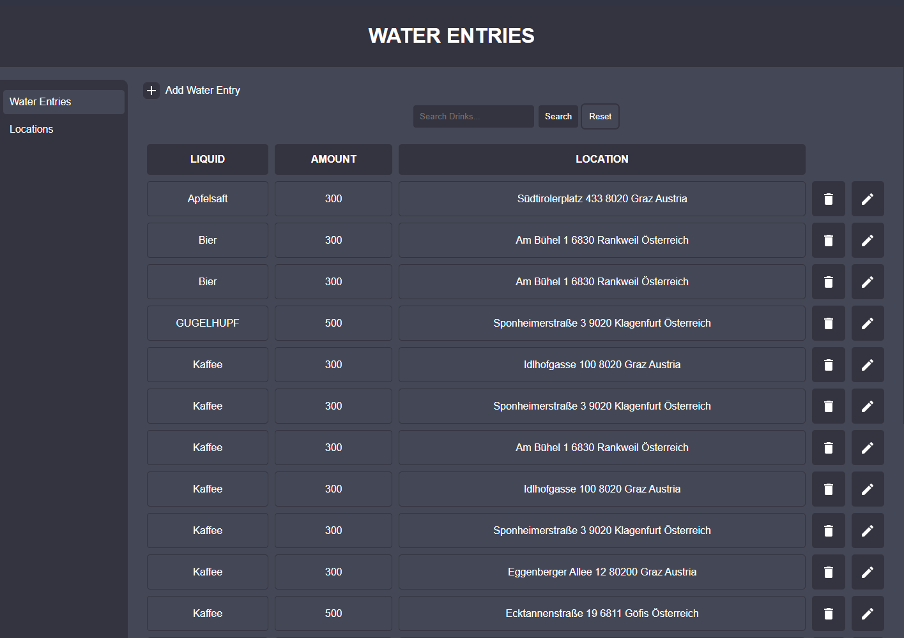
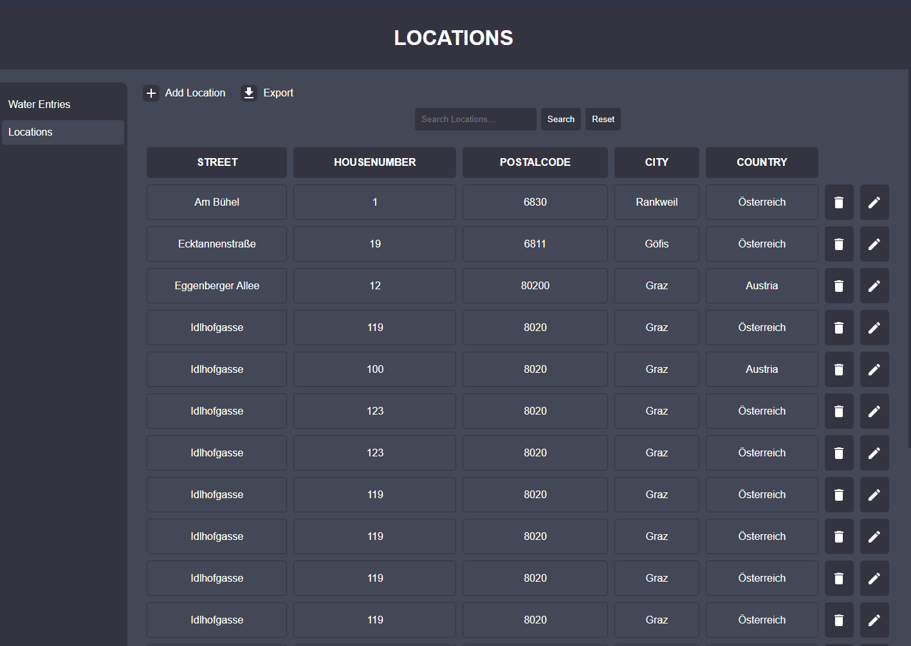
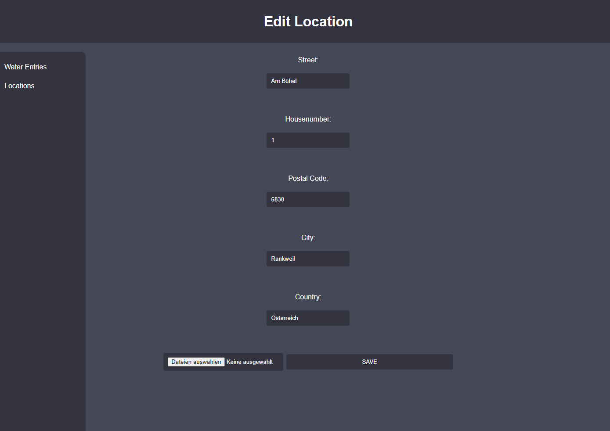
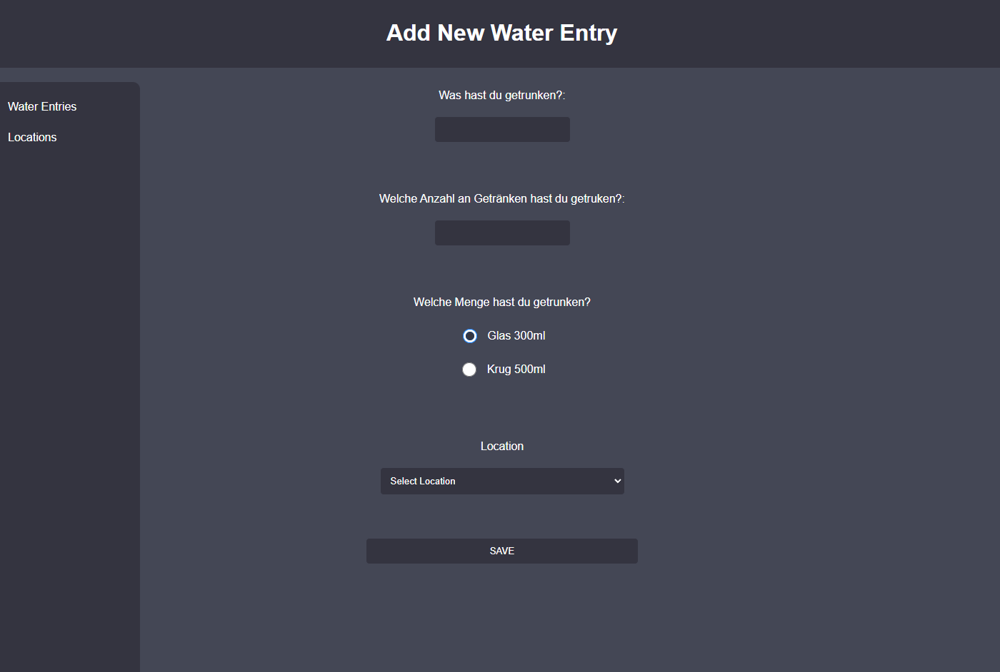

### Delete Function
I also implemented the delete function, which is pretty simple. I just added a button to the location overview page, 
which opens a modal, where you can confirm the deletion. If you click on the delete button, the location will be 
deleted from the database, and the form updates without reloading the page, because of the promise. If you click on the cancel button, the location will not be deleted.

Here you can see a little snippet of the delete function:
``` javascript
function removeLocation(id) {
  return new Promise((resolve, reject) => {
    const query = 'DELETE FROM locations WHERE id = ?';
    connection.query(query, [id], (error, results) => {
      if (error) {
        reject(error);
      } else {
        resolve(results);
      }
    });
  });
}
```

### Export Function

I fixed the export function, by adding ; instead of , to the csv file. That way the rows are separated correctly.

### Bug Fixes

Various bugs have been fixed, like updating the picture to improve the stability and functionality of the website.

## Emanuel Neziraj Tasks:

My main task was to implement a validation for add/edit location and the location details page. I also implemented a 
part of the integration with the water tracking page and a location duplication check.

### Add/Edit Location
For the add/edit - feature I had to implement a validation for the address. I used the openstreetmap API to validate 
the location. Furthermore, I implemented a location duplication check. If the location already exists, the user will 
get a warning message. If the location does not exist, the location will be added to the database. The location will be
added to the database with the longitude and latitude. The longitude and latitude will be used to show the location on
the map.

#### Latitude/Longitude
We needed the longitude and latitude of the location to show the location on a map and also to show on the details
page, which was also implemented by me. The longitude and latitude will be saved in the database.

For the longitude and latitude I used package geoCoder with the openstreetmap API. The API is called when the user 
clicks on the save button and is called with the location as parameter. If there is no existing location, the API will 
return an error message. If there is an existing location, the API will return the longitude and latitude of the 
location. The longitude and latitude will be saved in the database.

The API call takes some time, so I used a Promise to wait for the API call to finish.

There was a problem with the asynchronous API call. For the adding of the location, five different promises were
created. The problem was that the promises were not executed in the right order, so I had to nest the promises to
make sure that the promises were executed in the right order. The following code shows the nested promises for the 
validation, reading an image and save to base64 (done by Mohammed), check if there are duplicates, save the location
to the database and eventually map the location to a water entry.


### Location Validation
Additionally, with the longitude and latitude insertion, it is also a validation that the address is valid. If there is
no longitude and latitude, the location is not valid and the user will get a warning message. If there is a longitude
and latitude, the location is valid and the user will get a success message and the location will be added to the
database.

#### Duplication Check
I also added a duplication check. If the location already exists, the user will get a warning message. If the location
does not exist, the location will be added to the database. The check method asks the database if there is a location
with the same street, number, postcode, city and country. This was a little tricky, because updating a location with
the same address should be possible. Therefore, I had to check if the location is updated or added.

### Show Location Details
I added a details page, where you can see the details of a location. The details page shows the location address like
street, number, postcode, city, country and latitude and longitude, the location picture and the location on the
map. This was a main feature of this sprint.


#### Google Maps API

For the map I used the Google Maps API. The API is called when the user clicks on the details button. The API is called
with the longitude and latitude as parameter. If there is no existing location, the API will return an error message.

For this purpose, I needed a Google Maps API key. I created a new project in the Google Cloud Platform and created a
new API key. The API key is removed from the code and is not visible in the repository, due to security reasons.
**There will be a warning message in the console**, if the API key is not set and the map can only be shown in the 
development mode.


Following code shows the API call with the longitude and latitude as parameter. The code is provided by the Google
Maps API documentation.


### Integrate Location Selection with Water Tracking

I also implemented a part of the integration with the water tracking page. I implemented the join between the water
entries and the locations. The user can now select a location when he adds a water entry. Furthermore, a sidebar was
added to all pages and the water entries got a details page and a search function.

#### Sidebar

I added a sidebar to all pages. The sidebar contains a link to the water tracking page and a link to the location
overview page.


#### Water Entry Details

I added a details page for the water entries. The details page shows the water entry details like the type, the amount, 
the ml, the time it was created, the location and the picture. Most of the code was already implemented for the 
location details page.


#### Search Water Entries

I also used the search function for the location, which was provided by Abdullah and implemented it for the water
entries. The user can search for water entries by type.


## Julian Kapellari Tasks:


## Marin Sekic Tasks:
My Main Task for this Sprint was to implement the Add/Edit Feature for the Locations.
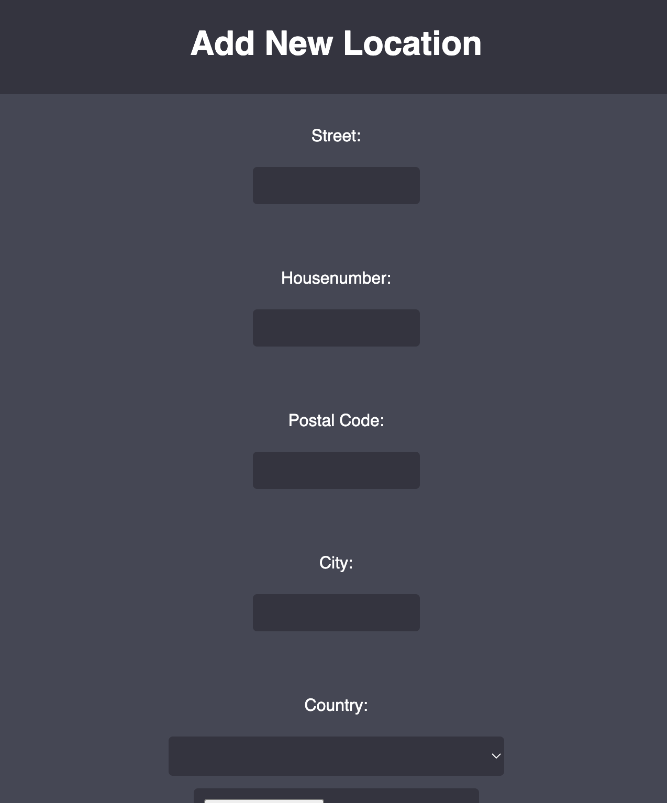
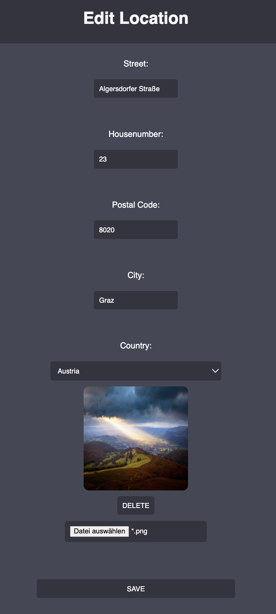
First, I created a basic HTML Form with the necessary values/input fields. (Just Blank HTML Structure - The HTML Site/Front End was designed by our Head of Design Vinzent Schmidt)
The Form is created in [form.js](views/form.js) and is returned as response after the route is called. (See [routes.js](routes.js))
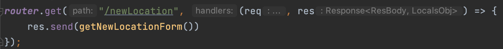
Afterwards I implemented the backend/logic for the data transfer to the database. After the Form was validated on the client side the Form triggers the route /AddLocation, which validates the data again on the Server Side and if everything is alright, then the Database Function is called.
It's a simple SQL query which saves the new Location to the Database (Online Hosted).
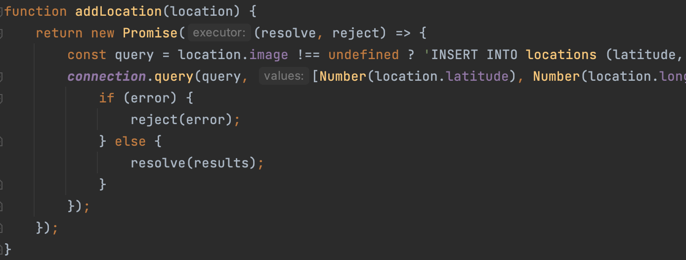
The Form Validation is done on both sides: Client and Server. Required Pattern with Regex on the Client Side directly in the Form and Regex with Formidable on the Server Side.
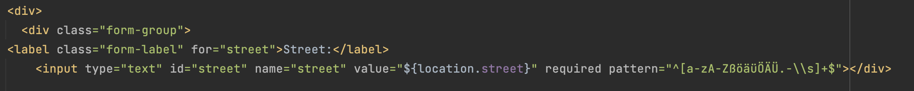
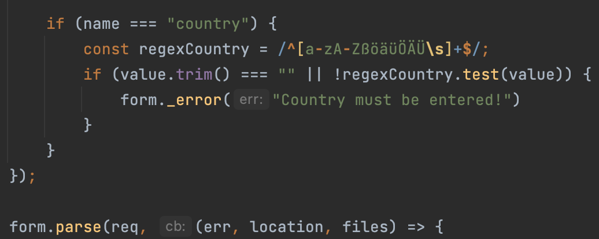
Additionally, we implemented also GeoCoder to validate, if the address exists. This was mainly done by my colleague Head of Software Emanuel Neziraj.
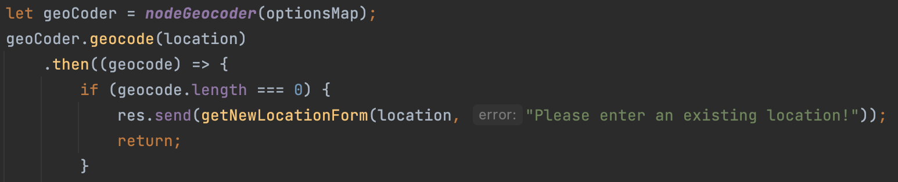
Also, the Edit Location Function was mainly done by me. After the Add Function was implemented, the Edit Funcation was at the base similar to the Add Function.

Here the Form gets loaded the same (with different routes), and is checked, if there is a Location Object existing. (null for Add, not null for Edit). With this condition the Form gets filled with the already existing Location and the Header is also adapted.
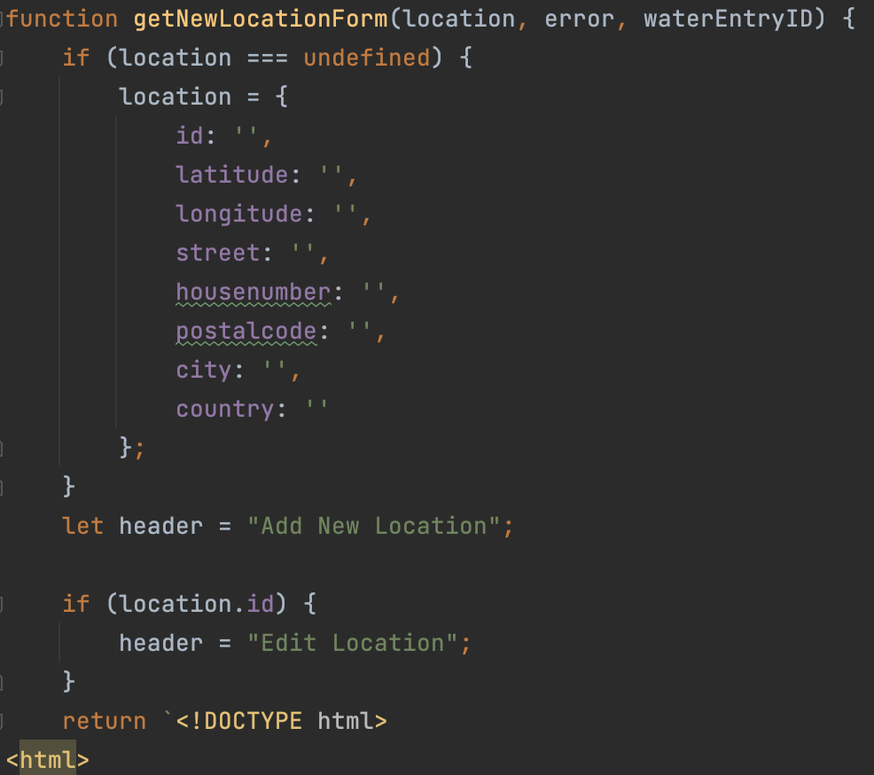

## Abdullah Kaitoua Tasks:
# Water-Tracking - Orte


## Overview

On overview page you can see all the places you have added. You can also add new places by clicking on the plus button. You can also delete places by clicking on the trash button. You can also edit places by clicking on the edit button. You can also see the details by clicking on the location row.

Additionaly you can click on the export button (icon) to export all the data to a csv file. More details about the export can be found in the export section.

## Edit/Add

On the edit/add page you can add a new place or edit an existing one. You can add an address, and a picture. The location can be added by clicking on the save button. The address will be converted to a location and the map will be centered on that location. You can also add a picture by clicking on the picture icon.

When a new location is added or updated, longitude and latitude will be saved in the database. The longitude and latitude will be used to show the location on the map. Additionally with the longitude and latitude insertion, it is also a validation that the address is valid.
## Delete

When you click on the trash button, you will be asked to confirm the deletion. If you click on the delete button, the location will be deleted from the database. If you click on the cancel button, the location will not be deleted.

If a location is deleted, all water entries for that location will not be deleted. The location will be set to null for all water entries.
## Integrate location selection with water tracking

With the watertracking integration, we made a sidebar that can be used to switch between the watertracking entrances and location entrances. Furthermore, we added a location row to the watertracking entrance. The location row will show the location name and the location address. If the location is not set, there is a dropdown window where you can choose one of the locations, which were added before or you can add a new location.

## Upload Picture

When you add a new location or edit an existing one you can add a picture. The picture will be converted to base64 and saved in the database. The picture will be shown on the details page, and on the edit page.

## Export Datas:

When you click on the export button, the locations will be exported to a csv file. The csv file will be downloaded to your computer where you want to store the data.

## Vinzent Schmid Tasks:

My main task was to design the whole "website" and to implement the delete function.

My inspiration for the design was ChatGPT, and I tried to make it look similar to that. For designing the fronted I only used CSS.

Here you can see the design of the website:


I also implemented the delete function, which is pretty simple. I just added a button to the location overview page, which opens a modal, where you can confirm the deletion. If you click on the delete button, the location will be deleted from the database. If you click on the cancel button, the location will not be deleted.

## Emanuel Neziraj Tasks:


## Julian Kapellari Tasks:


## Abdullah Kaitoua Tasks:

1- add a search function:
-Define a search endpoint
-Parse the query parameters from the search request.
-Connect to the database and run a query to retrieve the data based on the search parameters.
- Format the retrieved data and return it in the response.

### Search by Location

If the type parameter is set to "location", the code will perform a search on the locations table in the database. The 
search will look for matches in the columns street, house-number, postal-code, city, and country. The results are 
filtered using the LIKE SQL operator with the % wildcard symbol, allowing for partial string matches. The query is 
executed using the `db.search()` method, which returns a Promise. If the Promise is resolved, the locations result set is 
sent as a response with a status code of 200, using the `res.status(200).send()` method. If the Promise is rejected, the 
errorView function is called with the error, which generates an error response to be sent to the client.
### Search by Water

If the type parameter is set to "water", the code will perform a search on the water-entries table in the database, 
joining it with the locations table. The search will look for matches in the type column. The results are filtered 
using the LIKE SQL operator with the % wildcard symbol, allowing for partial string matches. The query is executed 
using the `db.search()` method, which returns a Promise. If the Promise is resolved, the `db.getAllLocations()` method 
is called to retrieve all location data from the locations table. If this Promise is resolved, the getWaterEntriesList 
function is called with the search results and all location data, generating a response to be sent to the client. If 
either Promise is rejected, the errorView function is called with the error, which generates an error response to be 
sent to the client.

### CSV Exporter

This module exports data from a database to a CSV file. It uses the fast-csv library to stream the data and send it as 
a download to the client.
Options

The options object passed to the `csv.write` method is used to configure the CSV file. The following properties are set:

    headers: This is set to true to include the headers in the first row of the file.
    delimiter: This is set to ; to separate the values with a semicolon.
    quoted_string: This is set to true to wrap string values in quotes.
    encoding: This is set to utf8 to specify the character encoding of the file.

### Data

The `db.getAllLocations` method is used to query the database and retrieve all the locations. The results are mapped to 
a new object with the properties id, latitude, longitude, street, house-number, postal-code, city, and country. This 
data is then written to the CSV file.

### Response

The response headers are set to specify the content type as text/csv; charset=UTF-8 and the content disposition as 
attachment; filename="locations.csv". This will cause the browser to prompt the user to download the file as 
locations.csv. The data is then streamed to the response object using the `csv.write` method.

### Error Handling

In case of any error, the errorView function is called and the error message is sent to the client with a status code 
of 500.

## Mohammed Alamer Tasks:

I had several Tasks, one Main task was to implement the feature of uploading an image or add an image to the location.
I implemented this task by breaking it into several smaller tasks and then solved each one at a time:

- Create a button that opens the file explorer
    - for this I used an input element with the type "file" in HTML 
- Allow only images
    - In order to allow only images I used the accept attribute
- allow uploading max. 1 image
    - I set the multiple attribute to false
- convert the image into a base64 string in order to save
    - In this part I faced a problem, it was not clear to me how to get the real image path in order to convert the image to
    a string `base64`. With the help of Emanuel Neziraj and Vinzent Schmid I realised that it was  a thinking mistake of me,
    and that I was trying to get the path by accessing the wrong object.
- display the image in location details

my second task was to take the role of a real user in order to find out the web app is usable enough for a normal user, and in order 
to check for any errors/mistakes by adding, editing and displaying the water entries and location entries.

## Packages
* [express](https://www.npmjs.com/package/express)
* [mysql2](https://www.npmjs.com/package/mysql2)
* [fast-csv](https://www.npmjs.com/package/fast-csv)
* [formidable](https://www.npmjs.com/package/formidable)
* [multer](https://www.npmjs.com/package/multer)
* [geocoder](https://www.npmjs.com/package/geocoder)
* [csv-stringify](https://www.npmjs.com/package/csv-stringify)
* [csv-parser](https://www.npmjs.com/package/csv-parser)
* [buffer](https://www.npmjs.com/package/buffer)

## References
* [Google Maps API:](https://developers.google.com/maps/documentation/javascript/overview)
* [OpenStreetMap:](https://www.openstreetmap.org/)
* [ChatGPT](https://chat.openai.com/)

## Development
Pull requests and major changes are welcome. Just send us the changed project, so we can take a look and learn from it.

Contact us:
* [Mohammed Alamer](mailto:moahmmed.alamer@edu.fh-joanneum.com)
* [Abdullah Kaitoua](mailto:abdullah.kaitoua@edu.fh-joanneum.com)
* [Julian Kapellari](mailto:julian.kapellari@edu.fh-joanneum.com)
* [Emanuel Neziraj](mailto:emanuel.neziraj@edu.fh-joanneum.com)
* [Vinzent Schmid](mailto:vinzent.schmid@edu.fh-joanneum.com)
* [Marin Sekic](mailto:marin.sekic@edu.fh-joanneum.com)

## License
* [npm](https://www.npmjs.com/package/npm)
* [node.js](https://nodejs.org/en/)

